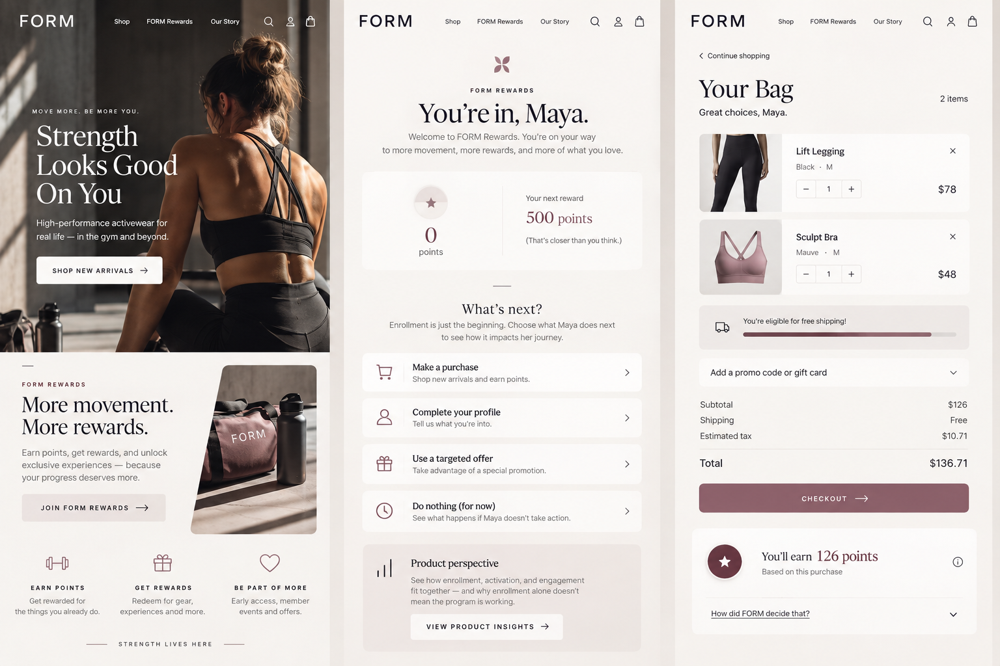
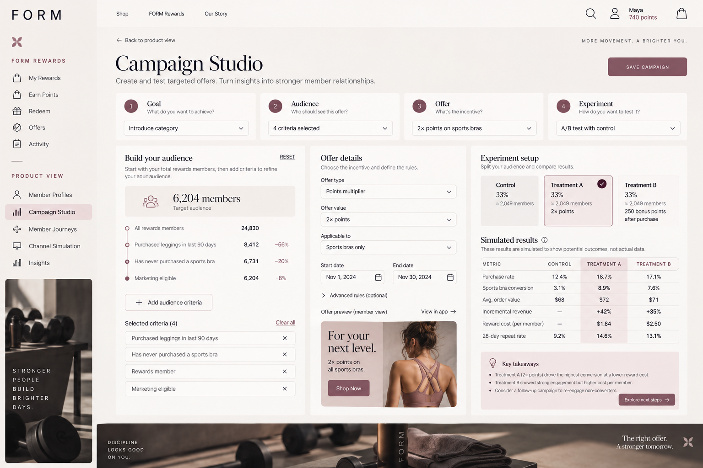

# Rewards & Incentives

**B2C Loyalty · B2B Partner Rewards · Activation & Engagement · Incentive Design**

Product studies and interactive explorations of how rewards and incentives shape behavior across consumer and partner products.

My professional experience spans both sides of this space: scaling consumer loyalty across ecommerce and POS, and a 0→1 B2B partner rewards platform. I'm interested in the product decisions underneath these experiences: how people activate and engage, how incentives shape behavior, how value is earned and redeemed, and how rules and systems keep the experience consistent.

Loyalty is often framed as a marketing feature. Underneath the member or partner experience, it is also a product problem involving eligibility, lifecycle, earning and redemption, promotions, experimentation, and program operations.

---

# B2C Loyalty

**Activation · Engagement · Targeted Promotions · Experimentation · Earning · Redemption · Omnichannel**

## FORM

FORM is a fictional women's activewear brand I created to showcase B2C loyalty through both the member experience and the product decisions behind it.

**[Launch the interactive B2C Loyalty study →](https://rtfenter.github.io/B2C-Loyalty-Product-Study/)**

The study moves between two perspectives:

**Member View**  
What Maya experiences as she joins FORM Rewards, earns points, receives and uses a targeted offer, redeems value, and interacts across channels.

**Product View**  
How FORM defines activation, eligibility, campaigns, experiments, lifecycle states, return policies, and omnichannel consistency.

### What it explores

- Enrollment vs. activation
- Base and promotional earning
- Targeted promotions and eligibility
- Audience segmentation
- A/B testing and control groups
- Engagement and lifecycle states
- Redemption and reward value
- Returns and reconciliation
- Ecommerce and POS
- Delayed activity and duplicate protection

## From Member Experience to Product Logic

The member experience brings the loyalty lifecycle into a consumer-facing product, from joining and earning to targeted offers, redemption, and activity across channels.

Campaign Studio explores audience rules, eligibility, offer design, experiment allocation, and the distinction between what a product team can configure and what customer behavior has to be observed.

### A Few Product Questions Inside FORM

**When is a member actually activated?**  
Enrollment tells us someone joined a program. It does not tell us whether the program has begun creating meaningful participation. FORM defines activation for this study as completing a first qualifying purchase after enrollment. The definition is explicit because activation is a product decision tied to the behavior a program is designed to create, not a universal loyalty metric.

**Who should receive an incentive?**  
Campaign Studio separates audience rules, eligibility, offer design, and experiment allocation from behavioral outcomes. A product team can control who qualifies and what experience they receive. It cannot know how customers will respond until that behavior is observed.

**What happens when loyalty value is returned?**  
A return is not always as simple as subtracting points from a balance. FORM preserves the relationship between earning, redemption, reward value, payment tender, and the transaction being reversed so the resulting balance and member history can be explained.

**What does omnichannel loyalty mean to the member?**  
Maya expects one FORM Rewards account. The product has to make ecommerce and POS activity resolve into that experience even when transactions arrive at different times. The study explores delayed activity, identity, reconciliation, and duplicate protection without assuming every channel operates in real time.

**[Explore FORM →](https://rtfenter.github.io/B2C-Loyalty-Product-Study/)**

---

# B2B Partner Rewards

**Eligibility · Activation · Tiering · Incentives · Partner Lifecycle · Program Operations**

B2B partner rewards share some mechanics with consumer loyalty, but the participant is a business account and the product problems change with it.

My next interactive study will explore:

- partner eligibility and opt-in
- activation
- tier qualification and progression
- qualifying business activity
- incentives and rewards
- partner lifecycle states
- program operations
- admin controls and permissions
- exceptions and suspension
- auditability

The goal is not to recreate consumer loyalty with companies substituted for people. It is to explore where the same underlying concepts behave differently in a B2B partner ecosystem.

---

# Product Principles

A few ideas connect the work across both B2C loyalty and B2B rewards.

### Rules Shape the Experience

Eligibility, earning, redemption, lifecycle, promotion, and exception rules determine what someone can actually do and what happens when circumstances change.

### Value Has to Remain Explainable

A member or partner should be able to understand what they earned, what they used, and what happened when something changed. That requires the underlying transactions and rules to tell a consistent story.

### Enrollment is not Activation

Entering a program is different from participating meaningfully in it. Activation has to be defined around the behavior and value the product is actually trying to create.

### Reconciliation Matters

Balances, transactions, program rules, and member- or partner-visible history need to agree. When they do not, what looks like a small experience problem can become an operational one.

### The Simple Experience Still Needs Reliable Systems

Members and partners shouldn't have to think about lifecycle states, delayed events, reconciliation, or operational controls. Product teams do. My loyalty work includes those platform concerns where they affect the experience, with deeper technical explorations in **[Systems of Trust](https://github.com/rtfenter/Systems-of-Trust-Series)**.

---

# About This Work

This repository is the public hub for my rewards and incentives work across B2C and B2B products.

FORM, its members, transactions, campaigns, program rules, and results are fictional. Simulated metrics are illustrative and do not represent any current or former employer.

The interactive studies are designed to make product decisions, rules, and tradeoffs visible without exposing proprietary systems or data.
